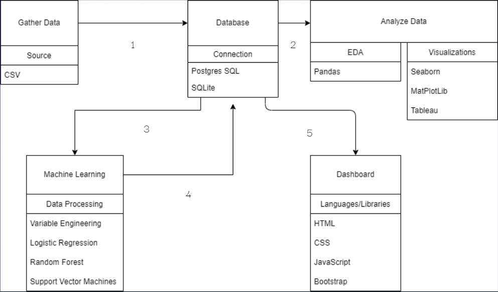

## Classification of Stars, Galaxies and Quasars based on spectral characterisitcs. 


### Abstract:

Apply various machine learning algorithms to classify Stars, Galaxies, and Quasars based on spectral characteristics using `100,000` labeled sources from **The Sloan Digital Sky Survey** (SDSS) data release 17. 

### Purpose:

In astronomy the early classification, distribution, and cataloging of stars have helped us understand how they make up our galaxy. This classification scheme has accelerated discoveries in astronomy and astrophysics through the support of an all-sky spectroscopic observation program that uses telescopes in both hemispheres to comprehensively map the night sky, examine the history and structure of the universe, and probe the physics of black holes. 

These next-generation telescopes are predicted to significantly increase the size of source catalogs and data and it will become unfeasible for astronomers to manually verify and label individual sources.

"While efforts such as Galaxy Zoo (Lintott et al. 2008, 2011) bring in many more people to help sift through data, these efforts alone are not expected to be able to keep up with the source counts anticipated for the next generation of telescopes." For such large datasets, machine learning algorithms are becoming an increasingly valuable tool for analysis and data exploration. "The development of such algorithms in computer science fields has accelerated rapidly in the last decade, focusing on processing large datasets in high performance computing workflows and cloud computing systems (Jones 2014; Wu et al. 2016)."

### Google Slides: 
https://docs.google.com/presentation/d/1H1HE5rhpyJQa0CFW6nn1D7o1Ps6UMqfJQ-FiysKqm8g/edit?usp=sharing

### Description of the source of data:

We chose the dataset from Kaggle.com, and we chose it for the number of data points, completeness and usability of the data.

https://www.kaggle.com/datasets/fedesoriano/stellar-classification-dataset-sdss17

The dataset consists of 100,000 observations of space taken by the SDSS. Every observation is described by 17 feature columns and 1 class column which identifies it to be either a star, galaxy or quasar.

```
The columns are as follows:

1.) obj_ID = Object Identifier, the unique value that identifies the object in the image catalog used by the CAS

2.) alpha = Right Ascension angle (at J2000 epoch)

3.) delta = Declination angle (at J2000 epoch)

4.) u = Ultraviolet filter in the photometric system

5.) g = Green filter in the photometric system

6.) r = Red filter in the photometric system

7.) i = Near Infrared filter in the photometric system

8.) z = Infrared filter in the photometric system

9.) run_ID = Run Number used to identify the specific scan

10.) rereun_ID = Rerun Number to specify how the image was processed

11.) cam_col = Camera column to identify the scanline within the run

12.) field_ID = Field number to identify each field

13.) spec_obj_ID = Unique ID used for optical spectroscopic objects (this means that 2 different observations with the same spec_obj_ID must share the output class)

14.) class = object class (galaxy, star or quasar object)

15.) redshift = redshift value based on the increase in wavelength

15.) plate = plate ID, identifies each plate in SDSS

16.) MJD = Modified Julian Date, used to indicate when a given piece of SDSS data was taken

17.) fiber_ID = fiber ID that identifies the fiber that pointed the light at the focal plane in each observation
```

### Acknowledgements:

The data released by the SDSS is under public domain. It's taken from the current data release RD17.

More information about the license: http://www.sdss.org/science/image-gallery/

SDSS Publications:

Abdurro’uf et al., The Seventeenth data release of the Sloan Digital Sky Surveys: Complete Release of MaNGA, MaStar and APOGEE-2 DATA (Abdurro’uf et al. submitted to ApJS) [arXiv:2112.02026]

### Questions we hope to answer with the data:

  - Which algorithm is best for predicting unbiased outcomes for each class?

  - Which filter in the photometric system is best for categorizing Stars/ Galaxies/ Quasars?

  - Which machine learning algorithm predicts the most accurate results?

### Outline of Workflow:



### Description of data exploration and analysis phase:

The Pandas module was used to complete the EDA phase. The data was complete with no null values and the spec_obj_ID column was used as the index since it was the unique identifier.

The  majority of the dataset comprised of galaxies, followed by stars and quasars.

Based on our research, we found that run_ID, rerun_ID, cam_col, field_ID, obj_ID, plate, MJD, fiber_ID all related to the image computing process. This led to the conclusion that these columns did not actually provide spectral characteristics for each stellar object and therefore should be dropped. 

Histograms and boxplots of our target variables against the other columns were graphed using the Seaborn module. The visualizations yielded that there were notiable differences between each stellar object and the different photometric filters observations. The visualization showed that the redshift,"i" and "r" characteristics had the most outliers.

 It was obserbed that quasars have a higher redshift, which correlates with scientific findings.
 
 See EDA file for full observations and visualizations.

[EDA](https://github.com/wonhee3472/Da_Vinci_Code/blob/main/EDA/EDA_04_24_22.ipynb)

### Description of preliminary data preprocessing:

  - All the columns that were not related to spectral characteristics (alpha','delta','run_ID','rerun_ID', 'cam_col', 'field_ID', "obj_ID",'plate', 'MJD', 'fiber_ID') were dropped.

  - The spec_obj_id is our index column since it is a unique identifier.

### Description of preliminary feature engineering and preliminary feature selection, including their decision-making process: 

  - There were 6 columns after the clean-up of data. Variable engineering was performed and the `u`,`g`,`r`,`i`,`z` columns were binned for each quartile.

  - For the feature selection for the X variable, we dropped the `Class` column and for the Y variable, we created our target which was the `Class` column.

### Description of how data was split into training and testing sets: 

  - The model is trained using the `sklearn.model_selection` and imported the `train_test_split` function.
  
  - The data was split into training and testing sets and set our `random_state` to 1.

  - The `y_train` was counted and the result was `('GALAXY': 44584, 'STAR': 16195, 'QSO': 14221)`. 
  
  -  The high number of `GALAXY` training data creates a slight imbalance in the dataset. Oversampling and Undersampling methods were applied to create a more balanced dataset. 
  
  - The following Machine Learning algorithms were applied to the `Stars vs. QSO vs. Galaxies` dataset:
        -   `LogisticRegression` (a multinomial class was chosen since there were 3 classes)
        -   `RandomForestClassifier`

  - The dataset was further broken down to `Stars vs. QSO`,`Stars vs. Galaxies`, and `Galaxies vs. QSO` and the following Machine Learning Algorithms         were applied to the newly created datasets:  
        -   `LogisticRegression` (a multinomial class was chosen since there were 3 classes)
        -   `RandomForestClassifier`    
        -   `Support Vector Machine`

### Explanation of model choice, including limitations and benefits:
The following classification models were chosen as the dataset is the dataset has multi-class classification labels (Star or QSO or Galaxy).

 - #### LogisticRegression:
     Results: 
     -  Accuracy : 96% - Oversampling
     -  Accuracy: 95.9% -  Undersampling
    
     - Oversampling - Stars vs. QSO vs. Galaxies
    
       

       

  Limitations: 
  - Leads to overfitting when observations are less than the number of features
  - Sensitive to outliers
  - Assumes independent and dependant variables have a linear relationship 
  - Training set must be separate from other data points
  
  Benefits: 
  - One of the simplest algorithms to test 
  - Efficient for linearly separable data
  - Can be used for binary classification, and extended to multi-classification
  
- #### RandomForestClassifer:
   Results:
   -  Accuracy : 97% - Oversampling
   -  Accuracy: 97% -  Undersampling
      
   - Oversampling - Stars vs. QSO vs. Galaxies
     
      
     
      

 Limitations: 
 - Requires more computational power and resources
 
 Benefits: 
 - Reduces overfitting and improves accuracy
 - It works well with datasets that have outliers
 

### Description of the communication protocols:

  - Slack: We are using this platform to constantly communicate ideas, sharing updates and checking on each other.
  
  - Zoom: We use this platform to brainstorm and code together.
  
  - Google Sheets: We use this platform as a project management tool to assign taks and check off tasks for each role, as well as track progress.
  
  - Google Docs : We are using this platform to create mockups for our Read Me and share technical informationan about our dataset. 
  
  - Git Hub: We will be storing/reviewing our work (e.g., code, dataset, database) on this Github Repository.
  
 ### Dashboard:
 
 We will be building a webpage using HTML, CSS, Bootstrap, and JavaScript and deploy it on GitHub pages.
 [Dashboard Deployment Draft #1](https://wonhee3472.github.io/Da_Vinci_Code/)

 ### The Team:

 1.) Crystal Tallent - [crtallent](https://github.com/crtallent)

 2.) Jane Mathew - [java2509](https://github.com/java2509)

 3.) Sarah Abraham - [abesarah](https://github.com/abesarah)

 4.) Wonhee Yun - [wonhee3472](https://github.com/wonhee3472)
